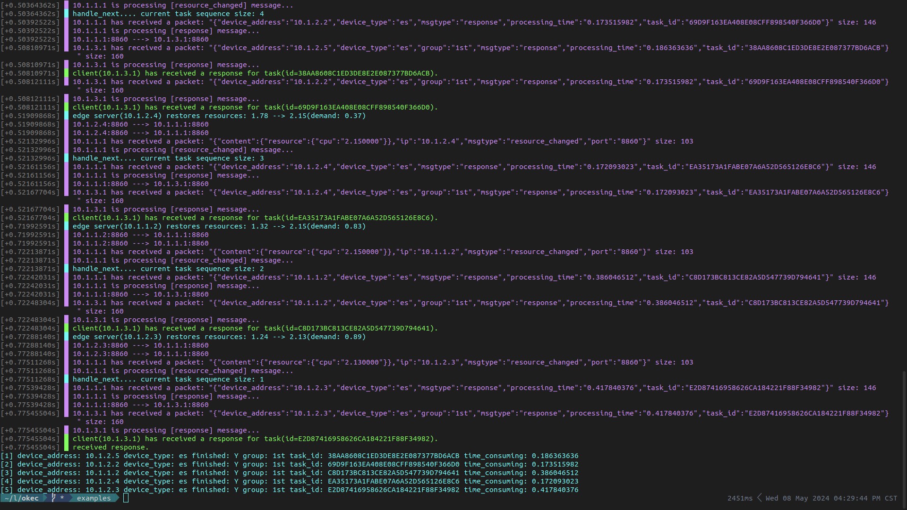
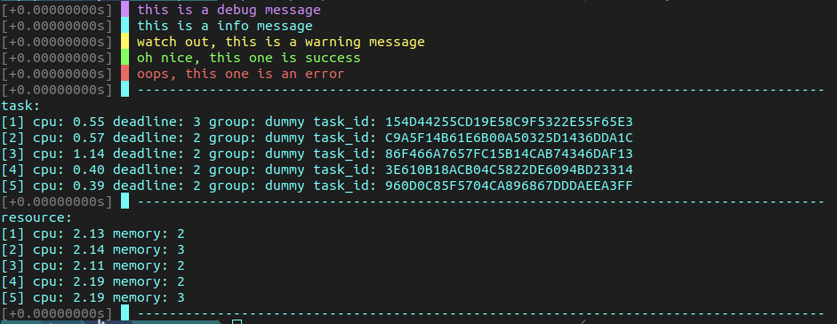
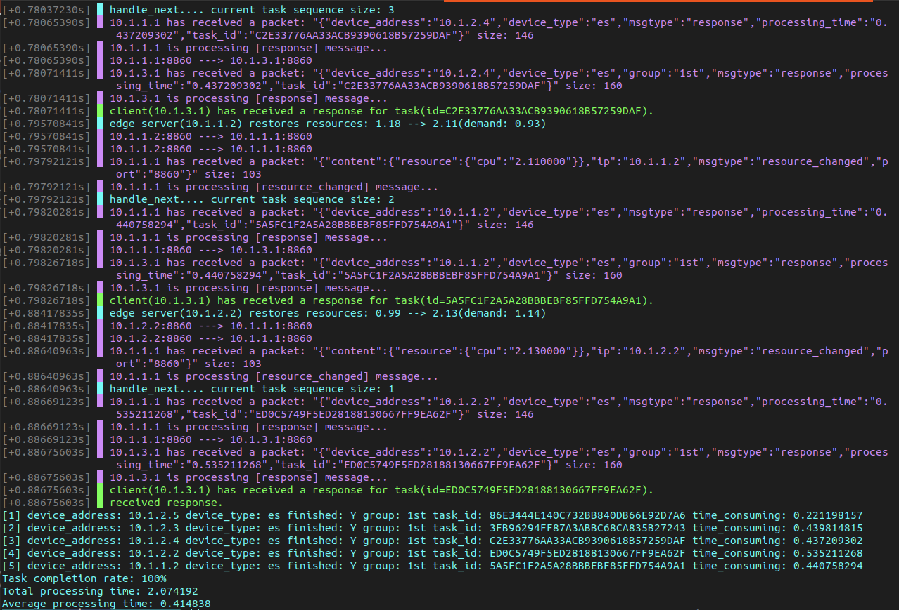
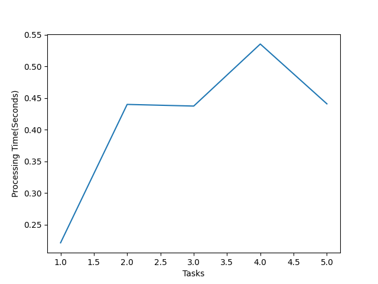

<p align="center">
<h1 align="center">OKEC(a.k.a. EdgeSim++)</h1>
<h6 align="center">A Realistic, Versatile, and Easily Customizable Edge Computing Simulator</h6>
</p>

[](https://ci.appveyor.com/project/lkimuk/okec)
[](https://github.com/lkimuk/okec/blob/main/LICENSE)
[](https://app.codacy.com/gh/lkimuk/okec/dashboard?utm_source=gh&utm_medium=referral&utm_content=&utm_campaign=Badge_grade)


[](http://isitmaintained.com/project/lkimuk/okec "Average time to resolve an issue")
[](http://isitmaintained.com/project/lkimuk/okec "Percentage of issues still open")

- [Prerequisites](#prerequisites)
- [Install](#install)
- [Features](#features)
- [Examples](#examples)
  - [Create heterogeneous devices with custom resources](#create-heterogeneous-devices-with-custom-resources)
  - [Create Tasks](#create-tasks)
  - [Iterate through tasks](#iterate-through-tasks)
  - [Append attributes to tasks and modify the task attribute values](#append-attributes-to-tasks-and-modify-the-task-attribute-values)
  - [Specify the default offloading strategy](#specify-the-default-offloading-strategy)
  - [Asynchronously offload your first set of tasks using the worst-fit decision engine with callbacks](#asynchronously-offload-your-first-set-of-tasks-using-the-worst-fit-decision-engine-with-callbacks)
  - [Asynchronously offload your first set of tasks using the worst-fit decision engine with coroutines](#asynchronously-offload-your-first-set-of-tasks-using-the-worst-fit-decision-engine-with-coroutines)
  - [Discretely offload the task using the DQN decision engine](#discretely-offload-the-task-using-the-dqn-decision-engine)
  - [Log](#log)
  - [Response Visualizer](#response-visualizer)

## Prerequisites
**Libraries**
|Library|Version|
|---|---|
|[NS-3](https://www.nsnam.org/releases/ns-3-41/)|3.41|
|[libtorch](https://pytorch.org/)|cxx11 ABI|
|[fmtlib](https://github.com/fmtlib/fmt)|N/A|
|[nlohmann\_json](https://github.com/nlohmann/json)|N/A|
|[matplotlib-cpp](https://github.com/lava/matplotlib-cpp)|N/A|

**Compiler**
- GCC 13 above
- Clang 13 above

|OS|Compiler Version|Status|
|---|---|---|
|Ubuntu 22.04|GCC 13.1|N/A|

## Install
```console
$ git clone https://github.com/lkimuk/okec.git
$ cd okec
$ cmake -S . -B build -DCMAKE_PREFIX_PATH:STRING=/absolute/path/to/your/libtorch
$ cmake --build build
$ cmake --install ./build
```

> [!NOTE]
> If your prerequisite libraries are not installed in standard directories, you may need to specify multiple paths as follows:

```console
$ git clone https://github.com/lkimuk/okec.git
$ cd okec
$ cmake -S . -B build -DCMAKE_PREFIX_PATH:STRING="/absolute/path/to/your/libtorch;/absolute/path/to/your/other/libraries"
$ cmake --build build
$ cmake --install ./build
```


**Run examples**
```console
$ cd examples
$ cmake -S . -B build
$ cmake --build build
$ ./wf-async
$ ./wf_discrete
$ ./wf_net
$ ./rf_discrete
```

## Features

- [x] Dynamic network modeling.
- [x] Mobility.
- [x] Multi-MEC architectures.
- [x] Dynamic Task/Resource attributes.
- [x] Resource monitoring.
- [x] Device interaction.
- [x] Decision engine
  - [x] Non-maching learning based offloading algorithms.
  - [x] Maching learning based offloading algorithms.
- [x] Linear/Discrete simulation.
- [x] Network topology visualization.
- [x] Results visualization.
- [x] Multi-layer scenarios.
- [x] Interated datasets.
- [ ] ...

## Examples
### Create heterogeneous devices with custom resources
In this trivial example, we create a base station connecting several edge servers. All heterogeneous devices initialize network communication using the `multiple_and_single_LAN_WLAN_network_model`. Additionally, we randomly generate some resources and install them on these edge servers.

```cpp
#include <okec/okec.hpp>


int main()
{
    okec::simulator sim;

    // Create 1 base station
    okec::base_station_container base_stations(sim, 1);
    // Create 5 edge servers
    okec::edge_device_container edge_servers(sim, 5);
    // Create 2 user devices
    okec::client_device_container user_devices(sim, 2);

    // Connect the base stations and edge servers
    base_stations.connect_device(edge_servers);

    // Set the network model for every device
    okec::multiple_and_single_LAN_WLAN_network_model model;
    okec::network_initializer(model, user_devices, base_stations.get(0));

    // Initialize the resources for each edge server.
    okec::resource_container resources(edge_servers.size());
    resources.initialize([](auto res) {
        res->attribute("cpu", okec::rand_range(2.1, 2.2).to_string());
    });

    // Print resources
    okec::print("{:rs}", resources);

    // Install each resource on each edge server.
    edge_servers.install_resources(resources);

    // Run the simulator
    sim.run();
}
```

### Create Tasks
**Generate tasks randomly**
```cpp
#include <okec/okec.hpp>

void generate_task(okec::task& t, int number, std::string const& group)
{
    for (auto i = number; i-- > 0;)
    {
        t.emplace_back({
            { "task_id", okec::task::get_unique_id() },
            { "group", group },
            { "cpu", okec::rand_range(0.2, 1.2).to_string() },
            { "deadline", okec::rand_range(1, 5).to_string() },
        });
    }
}

int main()
{
    okec::task t;
    generate_task(t, 10, "dummy");

    okec::print("{:t}", t);
}
```

The potential output:
```text
[ 1] cpu: 1.02 deadline: 3 group: dummy task_id: CC5855F2FB5922492B34F37B994CD5D
[ 2] cpu: 1.14 deadline: 4 group: dummy task_id: 13E009115B674D4A50DD60CE847DFC2
[ 3] cpu: 0.76 deadline: 4 group: dummy task_id: 1F276AAFF89D17AAE219E987DA7998A
[ 4] cpu: 0.34 deadline: 1 group: dummy task_id: 5D3DDEB066A080C9AC3A9B9DF752A91
[ 5] cpu: 0.81 deadline: 2 group: dummy task_id: 3FC95B4E167FEF99957143D35D21463
[ 6] cpu: 1.00 deadline: 4 group: dummy task_id: 82D8F41470CD15DB51D28E1D3A859AF
[ 7] cpu: 1.03 deadline: 3 group: dummy task_id: 4273D1952CB9B0099D36904978E9B28
[ 8] cpu: 0.74 deadline: 3 group: dummy task_id: 8A201C54390FD95BA6A467F1426048B
[ 9] cpu: 0.29 deadline: 3 group: dummy task_id: F3FD22F2A9196DE93915ACEF0A612FA
[10] cpu: 0.52 deadline: 4 group: dummy task_id: 072EA1D4AB870B2B15ABCC5DE036FBE
```

**Save tasks and Load them from files**
```cpp
#include <okec/okec.hpp>

void generate_task(okec::task& t, int number, std::string const& group)
{
    for (auto i = number; i-- > 0;)
    {
        t.emplace_back({
            { "task_id", okec::task::get_unique_id() },
            { "group", group },
            { "cpu", okec::rand_range(0.2, 1.2).to_string() },
            { "deadline", okec::rand_range(1, 5).to_string() },
        });
    }
}

int main()
{
    okec::task t1;
    generate_task(t1, 5, "dummy");
    t1.save_to_file("task.json");

    okec::task t2;
    t2.load_from_file("task.json");

    okec::print("t1:\n{:t}\n", t1);
    okec::print("t2:\n{:t}", t2);
}
```

The potential output:
```text
t1:
[1] cpu: 0.94 deadline: 3 group: dummy task_id: C8487480083EF6FA51A07F6786112B2
[2] cpu: 0.87 deadline: 3 group: dummy task_id: AA6E00D9D1D676999810EC793D4091F
[3] cpu: 0.70 deadline: 3 group: dummy task_id: D7C9B93D88725A6B0A7F24C8D5576E9
[4] cpu: 0.27 deadline: 4 group: dummy task_id: D8A72C409FC97BD9B8C6478CD69D23A
[5] cpu: 0.30 deadline: 3 group: dummy task_id: 05019AFC1C46E9581755D2B819B5092

t2:
[1] cpu: 0.94 deadline: 3 group: dummy task_id: C8487480083EF6FA51A07F6786112B2
[2] cpu: 0.87 deadline: 3 group: dummy task_id: AA6E00D9D1D676999810EC793D4091F
[3] cpu: 0.70 deadline: 3 group: dummy task_id: D7C9B93D88725A6B0A7F24C8D5576E9
[4] cpu: 0.27 deadline: 4 group: dummy task_id: D8A72C409FC97BD9B8C6478CD69D23A
[5] cpu: 0.30 deadline: 3 group: dummy task_id: 05019AFC1C46E9581755D2B819B5092
```

### Iterate through tasks
```cpp
#include <okec/okec.hpp>

void generate_task(okec::task& t, int number, std::string const& group)
{
    for (auto i = number; i-- > 0;)
    {
        t.emplace_back({
            { "task_id", okec::task::get_unique_id() },
            { "group", group },
            { "cpu", okec::rand_range(0.2, 1.2).to_string() },
            { "deadline", okec::rand_range(1, 5).to_string() },
        });
    }
}

int main()
{
    okec::task t;
    generate_task(t, 10, "dummy");

    for (auto const& item : t.elements())
    {
        okec::print("task_id: {} ", item.get_header("task_id"));
        okec::print("group: {} ", item.get_header("group"));
        okec::print("cpu: {} ", item.get_header("cpu"));
        okec::print("deadline: {}\n", item.get_header("deadline"));
    }
}
```

The potential output:
```text
task_id: E99E1850C94F616A2E7A2F01FEA4F43 group: dummy cpu: 1.15 deadline: 4
task_id: 2E54F007DCA13C89621C9D554F7203B group: dummy cpu: 1.05 deadline: 4
task_id: B430A892935CE16A2DD458A0E73013E group: dummy cpu: 0.46 deadline: 4
task_id: 8FEE0B90F2ABF3280B573C1517CF487 group: dummy cpu: 0.83 deadline: 2
task_id: CFAF12948696F9AA25D2EA45D99F3CC group: dummy cpu: 0.87 deadline: 4
task_id: B89CF926127909C91641670DCF59E16 group: dummy cpu: 0.87 deadline: 1
task_id: A75B4F6C8828E7B98550FA8E59232FB group: dummy cpu: 0.24 deadline: 1
task_id: A838D2B4E534D9E8556B7F5228A5F0D group: dummy cpu: 0.65 deadline: 4
task_id: 42CC12E43AEF2E9AC50C47E675050C1 group: dummy cpu: 0.77 deadline: 4
task_id: 5BEE99DFF8F012C9FB10DA9E81C5DF9 group: dummy cpu: 0.76 deadline: 3
```

### Append attributes to tasks and modify the task attribute values
```cpp
#include <okec/okec.hpp>

void generate_task(okec::task& t, int number, std::string const& group)
{
    for (auto i = number; i-- > 0;)
    {
        t.emplace_back({
            { "task_id", okec::task::get_unique_id() },
            { "group", group },
            { "cpu", okec::rand_range(0.2, 1.2).to_string() },
            { "deadline", okec::rand_range(1, 5).to_string() },
        });
    }
}

int main()
{
    okec::task t;
    generate_task(t, 10, "dummy");

    okec::print("Before:\n{:t}\n", t);

    for (auto& item : t.elements_view())
    {
        item.set_header("memory", okec::rand_range(10.0, 100.0).to_string());
    }

    t.at(2).set_header("deadline", "20");

    okec::print("After:\n{:t}", t);
}
```

The potential output:
```text
Before:
[ 1] cpu: 0.91 deadline: 2 group: dummy task_id: D759A6B6161BCE3B25C7AC79064D082
[ 2] cpu: 0.36 deadline: 1 group: dummy task_id: F058239672AD6108DF9CFBDA74B5628
[ 3] cpu: 0.27 deadline: 2 group: dummy task_id: 109DC14559C70AB880E2AE44588E2B6
[ 4] cpu: 1.05 deadline: 2 group: dummy task_id: 1D55F6D4EC004FBB0D449EF3FC325A2
[ 5] cpu: 0.45 deadline: 4 group: dummy task_id: 5FC152A187472BCB51FEC24C1B34808
[ 6] cpu: 1.03 deadline: 4 group: dummy task_id: 3811B94C6FB3E20817FA648746EEFB7
[ 7] cpu: 0.43 deadline: 4 group: dummy task_id: 009A7DA8A7E0643B84391C790D0562B
[ 8] cpu: 0.74 deadline: 2 group: dummy task_id: 486E9DD50B5AE6BA4DB76CB6CCAD057
[ 9] cpu: 0.93 deadline: 3 group: dummy task_id: 770DE1C994C61ACBAAF8C708C0A90D8
[10] cpu: 0.89 deadline: 1 group: dummy task_id: 026D7FF78ADDEC098EF62A6316DD75C

After:
[ 1] cpu: 0.91 deadline: 2 group: dummy memory: 12.29 task_id: D759A6B6161BCE3B25C7AC79064D082
[ 2] cpu: 0.36 deadline: 1 group: dummy memory: 47.81 task_id: F058239672AD6108DF9CFBDA74B5628
[ 3] cpu: 0.27 deadline: 20 group: dummy memory: 99.64 task_id: 109DC14559C70AB880E2AE44588E2B6
[ 4] cpu: 1.05 deadline: 2 group: dummy memory: 17.39 task_id: 1D55F6D4EC004FBB0D449EF3FC325A2
[ 5] cpu: 0.45 deadline: 4 group: dummy memory: 90.99 task_id: 5FC152A187472BCB51FEC24C1B34808
[ 6] cpu: 1.03 deadline: 4 group: dummy memory: 45.24 task_id: 3811B94C6FB3E20817FA648746EEFB7
[ 7] cpu: 0.43 deadline: 4 group: dummy memory: 41.11 task_id: 009A7DA8A7E0643B84391C790D0562B
[ 8] cpu: 0.74 deadline: 2 group: dummy memory: 84.72 task_id: 486E9DD50B5AE6BA4DB76CB6CCAD057
[ 9] cpu: 0.93 deadline: 3 group: dummy memory: 82.40 task_id: 770DE1C994C61ACBAAF8C708C0A90D8
[10] cpu: 0.89 deadline: 1 group: dummy memory: 37.67 task_id: 026D7FF78ADDEC098EF62A6316DD75C
```

### Specify the default offloading strategy
```cpp
#include <okec/okec.hpp>

namespace olog = okec::log;


int main()
{
    olog::set_level(olog::level::debug);
    okec::simulator sim;

    // Create 1 base station
    okec::base_station_container base_stations(sim, 1);
    // Create 5 edge servers
    okec::edge_device_container edge_servers(sim, 5);
    // Create 2 user devices
    okec::client_device_container user_devices(sim, 2);

    // Connect the base stations and edge servers
    base_stations.connect_device(edge_servers);

    // Set the network model for every device
    okec::multiple_and_single_LAN_WLAN_network_model model;
    okec::network_initializer(model, user_devices, base_stations.get(0));

    // Initialize the resources for each edge server.
    okec::resource_container resources(edge_servers.size());
    resources.initialize([](auto res) {
        res->attribute("cpu", okec::rand_range(2.1, 2.2).to_string());
    });

    // Install each resource on each edge server.
    edge_servers.install_resources(resources);

    // Specify the default offloading strategy
    auto decision_engine = std::make_shared<okec::worst_fit_decision_engine>(&user_devices, &base_stations);
    decision_engine->initialize();

    // Run the simulator
    sim.run();
}
```

When your program runs, the decision engine will automatically gather resource information from all edge servers that have installed resources.

```text
[+0.00000000s] █ The decision engine received resource information from edge server(10.1.1.2).
[+0.00000000s] █ The decision engine received resource information from edge server(10.1.2.2).
[+0.00000000s] █ The decision engine received resource information from edge server(10.1.2.3).
[+0.00000000s] █ The decision engine received resource information from edge server(10.1.2.4).
[+0.00000000s] █ The decision engine received resource information from edge server(10.1.2.5).
```

### Asynchronously offload your first set of tasks using the worst-fit decision engine with callbacks
```cpp
#include <okec/okec.hpp>

namespace olog =  okec::log;


void generate_task(okec::task& t, int number, std::string const& group)
{
    for (auto i = number; i-- > 0;)
    {
        t.emplace_back({
            { "task_id", okec::task::get_unique_id() },
            { "group", group },
            { "cpu", okec::rand_range(0.2, 1.2).to_string() },
            { "deadline", okec::rand_range(1, 5).to_string() },
        });
    }
}


int main()
{
    olog::set_level(olog::level::all);
    okec::simulator sim;

    // Create 1 base station
    okec::base_station_container base_stations(sim, 1);
    // Create 5 edge servers
    okec::edge_device_container edge_servers(sim, 5);
    // Create 2 user devices
    okec::client_device_container user_devices(sim, 2);

    // Connect the base stations and edge servers
    base_stations.connect_device(edge_servers);

    // Set the network model for every device
    okec::multiple_and_single_LAN_WLAN_network_model model;
    okec::network_initializer(model, user_devices, base_stations.get(0));

    // Initialize the resources for each edge server.
    okec::resource_container resources(edge_servers.size());
    resources.initialize([](auto res) {
        res->attribute("cpu", okec::rand_range(2.1, 2.2).to_string());
    });

    // Install each resource on each edge server.
    edge_servers.install_resources(resources);

    // Specify the default offloading strategy
    auto decision_engine = std::make_shared<okec::worst_fit_decision_engine>(&user_devices, &base_stations);
    decision_engine->initialize();


    // Offload tasks
    okec::task t;
    generate_task(t, 5, "1st");
    auto user1 = user_devices.get_device(0);
    user1->async_send(std::move(t));
    user1->async_read([](auto resp) {
        olog::success("received response.");

        okec::print("{:r}", resp);
    });


    // Run the simulator
    sim.run();
}
```

### Asynchronously offload your first set of tasks using the worst-fit decision engine with coroutines 
```cpp
#include <okec/okec.hpp>

namespace olog =  okec::log;

void generate_task(okec::task& t, int number, std::string const& group)
{
    for (auto i = number; i-- > 0;)
    {
        t.emplace_back({
            { "task_id", okec::task::get_unique_id() },
            { "group", group },
            { "cpu", okec::rand_range(0.2, 1.2).to_string() },
            { "deadline", okec::rand_range(1, 5).to_string() },
        });
    }
}

okec::awaitable offloading(auto user, okec::task t) {
    olog::debug("offloading begin");

    co_await user->async_send(std::move(t));
    auto resp = co_await user->async_read();
    olog::success("received response.");

    okec::print("{:r}", resp);
}

int main()
{
    olog::set_level(olog::level::all);
    okec::simulator sim;

    // Create 1 base station
    okec::base_station_container base_stations(sim, 1);
    // Create 5 edge servers
    okec::edge_device_container edge_servers(sim, 5);
    // Create 2 user devices
    okec::client_device_container user_devices(sim, 2);

    // Connect the base stations and edge servers
    base_stations.connect_device(edge_servers);

    // Set the network model for every device
    okec::multiple_and_single_LAN_WLAN_network_model model;
    okec::network_initializer(model, user_devices, base_stations.get(0));

    // Initialize the resources for each edge server.
    okec::resource_container resources(edge_servers.size());
    resources.initialize([](auto res) {
        res->attribute("cpu", okec::rand_range(2.1, 2.2).to_string());
    });

    // Install each resource on each edge server.
    edge_servers.install_resources(resources);

    // Specify the default offloading strategy
    auto decision_engine = std::make_shared<okec::worst_fit_decision_engine>(&user_devices, &base_stations);
    decision_engine->initialize();


    // Offload tasks
    okec::task t;
    generate_task(t, 5, "1st");
    auto user1 = user_devices.get_device(0);
    co_spawn(sim, offloading(user1, t));


    // Run the simulator
    sim.run();
}
```

Output:


### Discretely offload the task using the DQN decision engine

```cpp
#include <okec/okec.hpp>

namespace olog =  okec::log;


void generate_task(okec::task& t, int number, std::string const& group)
{
    for (auto i = number; i-- > 0;)
    {
        t.emplace_back({
            { "task_id", okec::task::get_unique_id() },
            { "group", group },
            { "cpu", okec::rand_range(0.2, 1.2).to_string() },
            { "deadline", okec::rand_range(1, 5).to_string() },
        });
    }
}


int main()
{
    olog::set_level(olog::level::all);
    okec::simulator sim;

    // Create 1 base station
    okec::base_station_container base_stations(sim, 1);
    // Create 5 edge servers
    okec::edge_device_container edge_servers(sim, 5);
    // Create 2 user devices
    okec::client_device_container user_devices(sim, 2);

    // Connect the base stations and edge servers
    base_stations.connect_device(edge_servers);

    // Set the network model for every device
    okec::multiple_and_single_LAN_WLAN_network_model model;
    okec::network_initializer(model, user_devices, base_stations.get(0));

    // Initialize the resources for each edge server.
    okec::resource_container resources(edge_servers.size());
    resources.initialize([](auto res) {
        res->attribute("cpu", okec::rand_range(2.1, 2.2).to_string());
    });

    // Install each resource on each edge server.
    edge_servers.install_resources(resources);

    // Specify the default offloading strategy
    auto decision_engine = std::make_shared<okec::DQN_decision_engine>(&user_devices, &base_stations);
    decision_engine->initialize();


    // Discretely offload the task using the DQN decision engine.
    okec::task t;
    generate_task(t, 5, "1st");
    int episode = 5;
    decision_engine->train(t, episode);


    // Run the simulator
    sim.run();
}
```

Output:


### Log
This logging module is inspired by [Stargirl](https://x.com/theavalkyrie/status/1768787170137940141).

```cpp
#include <okec/okec.hpp>

namespace olog =  okec::log;

void generate_task(okec::task& t, int number, std::string const& group)
{
    for (auto i = number; i-- > 0;)
    {
        t.emplace_back({
            { "task_id", okec::task::get_unique_id() },
            { "group", group },
            { "cpu", okec::rand_range(0.2, 1.2).to_string() },
            { "deadline", okec::rand_range(1, 5).to_string() },
        });
    }
}

int main()
{
    olog::set_level(olog::level::all);

    olog::debug("this is a debug message");
    olog::info("this is a info message");
    olog::warning("watch out, this is a warning message");
    olog::success("oh nice, this one is success");
    olog::error("oops, this one is an error");


    olog::info("{0:-^{1}}", "", okec::get_winsize().col - olog::indent_size());

    // Print tasks
    okec::task t;
    generate_task(t, 5, "dummy");
    okec::print("task:\n{:t}", t);

    olog::info("{0:-^{1}}", "", okec::get_winsize().col - olog::indent_size());

    // Print resources
    okec::resource_container resources(5);
    resources.initialize([](auto res) {
        res->attribute("cpu", okec::rand_range(2.1, 2.2).to_string());
        res->attribute("memory", okec::rand_range(1, 4).to_string());
    });
    okec::print("resource:\n{:rs}", resources);

    olog::info("{0:-^{1}}", "", okec::get_winsize().col - olog::indent_size());
}
```

Output:


### Response Visualizer
```cpp
#include <okec/okec.hpp>

namespace olog =  okec::log;

void generate_task(okec::task& t, int number, std::string const& group)
{
    for (auto i = number; i-- > 0;)
    {
        t.emplace_back({
            { "task_id", okec::task::get_unique_id() },
            { "group", group },
            { "cpu", okec::rand_range(0.2, 1.2).to_string() },
            { "deadline", okec::rand_range(1, 5).to_string() },
        });
    }
}

okec::awaitable offloading(auto user, okec::task t) {
    std::vector<int> x_points(t.size());
    std::ranges::iota(x_points, 1);

    co_await user->async_send(std::move(t));
    auto resp = co_await user->async_read();
    olog::success("received response.");

    okec::print("{:r}", resp);
    double finished = 0;
    std::vector<double> time_points;
    for (const auto& item : resp.data()) {
        if (item["finished"] == "Y") {
            finished++;
            time_points.push_back(TO_DOUBLE(item["time_consuming"]));
        }
    }

    auto total_time = std::accumulate(time_points.begin(), time_points.end(), .0);
    okec::print("Task completion rate: {:2.0f}%\n", finished / resp.size() * 100);
    okec::print("Total processing time: {:.6f}\n", total_time);
    okec::print("Average processing time: {:.6f}\n", total_time / time_points.size());

    okec::draw(x_points, time_points, "Tasks", "Processing Time(Seconds)");
}

int main()
{
    olog::set_level(olog::level::all);
    okec::simulator sim;

    // Create 1 base station
    okec::base_station_container base_stations(sim, 1);
    // Create 5 edge servers
    okec::edge_device_container edge_servers(sim, 5);
    // Create 2 user devices
    okec::client_device_container user_devices(sim, 2);

    // Connect the base stations and edge servers
    base_stations.connect_device(edge_servers);

    // Set the network model for every device
    okec::multiple_and_single_LAN_WLAN_network_model model;
    okec::network_initializer(model, user_devices, base_stations.get(0));

    // Initialize the resources for each edge server.
    okec::resource_container resources(edge_servers.size());
    resources.initialize([](auto res) {
        res->attribute("cpu", okec::rand_range(2.1, 2.2).to_string());
    });

    // Install each resource on each edge server.
    edge_servers.install_resources(resources);

    // Specify the default offloading strategy
    auto decision_engine = std::make_shared<okec::worst_fit_decision_engine>(&user_devices, &base_stations);
    decision_engine->initialize();


    // Offload tasks
    okec::task t;
    generate_task(t, 5, "1st");
    auto user1 = user_devices.get_device(0);
    co_spawn(sim, offloading(user1, t));


    // Run the simulator
    sim.run();
}
```

Output:


